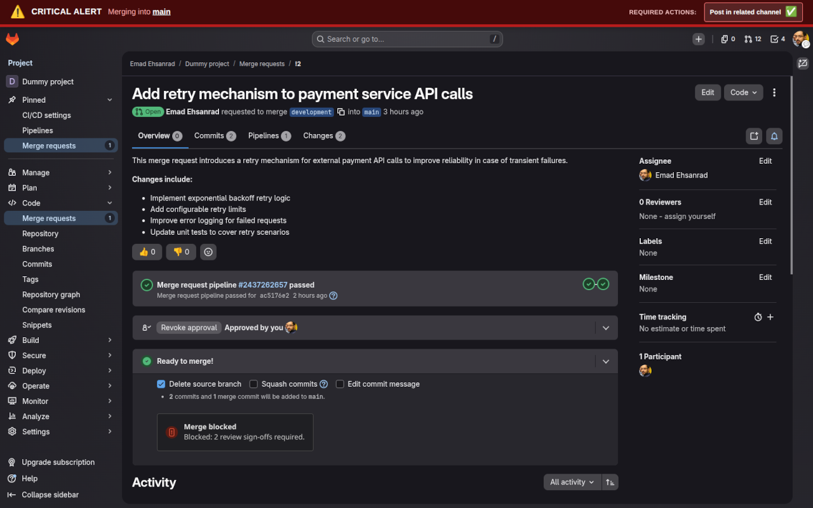

A lightweight browser extension that brings **merge request approval enforcement** to your team—helping prevent accidental merges and ensuring code quality. Enjoy **GitLab Premium-level safeguards for free**.

## Features

* **Block merge button until approval:** Prevents merging until at least one team member has approved the MR.
* **Custom banners:** Reminds contributors to:

  * Get a review from another team member
  * Post updates in relevant channels
  * Ensure a DevOps member is involved when needed
* **Branch protection:** Configure which branches should be protected directly in your team’s browsers.
* **Easy setup:** Works instantly without modifying GitLab server settings.

## Installation

* **Chrome Web Store:** [GitLab MR Approval Guard on Chrome Web Store](https://chromewebstore.google.com/detail/gitlab-mr-approval-guard/gkkmbokndbfihjbkcfmhmccboleeegjm) — enforces approval rules and displays a persistent reminder banner on GitLab merge requests.
* **Firefox Add‑ons:** [GitLab MR Approval Guard on Firefox Add‑ons](https://addons.mozilla.org/en-US/firefox/addon/gitlab-mr-approval-guard) — a lightweight browser extension that blocks merging without approvals and shows a warning banner for protected branches.

## Usage

Once installed, the extension will:

* Display a banner on top of the MR page
* Block the merge button until the MR has at least one approval
* Remind contributors to follow team review guidelines

You can configure branch protection and banner behavior in the extension settings.

## Why Use This Extension?

Even minor oversights in the review process can cause production issues. This extension:

* Standardizes review practices
* Improves team collaboration
* Reduces risk of accidental merges
* Saves your team from costly mistakes

All the benefits of **GitLab Premium Merge Request Approvals**, available freely.

## Demo

*The merge button is blocked and the banner reminds the contributor to get approval before merging.*

## Contributing

Contributions are welcome! Feel free to:

* Open issues for bugs or feature requests
* Submit pull requests for enhancements
* Share your feedback and use cases

## License

This project is licensed under the MIT License. See the [LICENSE](LICENSE) file for details.
